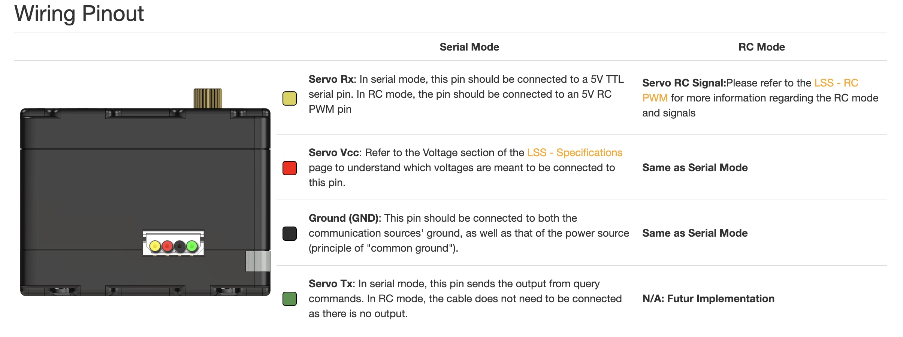
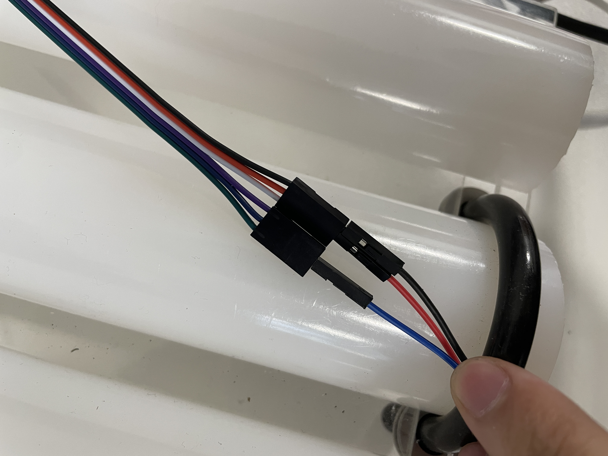
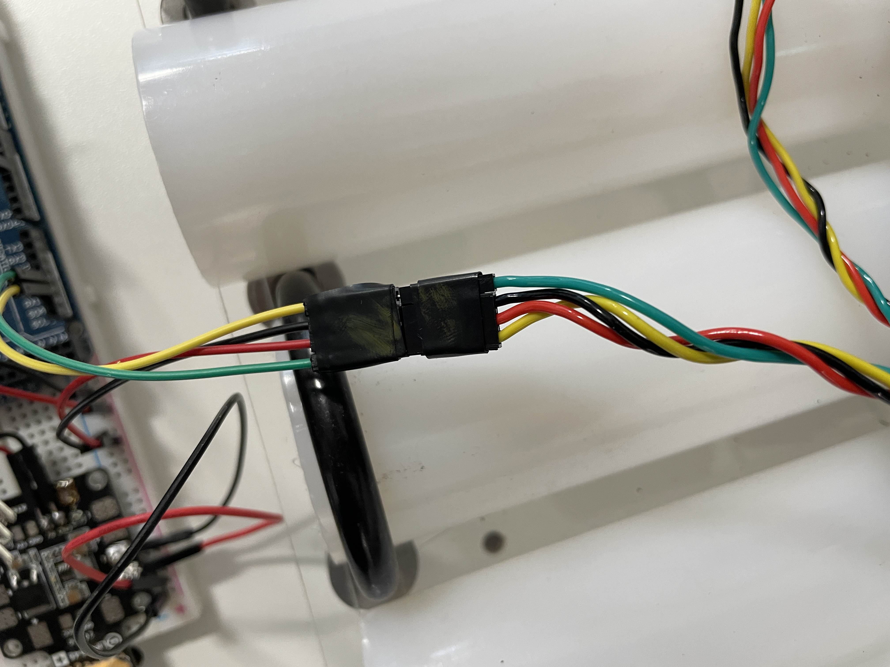

# BECOv2
This repo is aimed for RoboLAND and experiment on Multi-Agent Robot

The repo is divided into four parts: Mega 2560, simulation, analysis and CAD 

### Mega 2560 
This part is directly communicating with our actual rebot using mega 2560 micro-controller unit. 

Before running the controller, please read followings:

#### A. Wiring 

There are two major connections:

1. **UART (RX/TX) with LSS motor**  
   **Important**: please double check the wire direction of the power and ground of the LSS wire:  [See official wiring guide](https://wiki.lynxmotion.com/info/wiki/lynxmotion/view/ses-v2/lynxmotion-smart-servo/lss-electrical/)
     

   We used Serial1 from Mega 2560 to communicate with the motor, which corresponds to pin 18 (TX1) and pin 19 (RX1) on the board.

2. **PWM with linear actuator**  
   We used pin 4 (PWM capable) to connect with the linear actuator.  
   Make sure the blue wire matches the blue wire on the actuator.  
     

All the wiring directions are marked, please check the markers:  
    

#### B. Power
1. Power should be connected to the PDB with maxium 12V and minimum 6V. And current should never exceed 1A, 650mA is enough
2. Power for linear actuator and motor are both 12 V.
#### B. Coding
1. Download platformIO from vscode extensions
2. Main file in src, use platformIO to compile (main.cpp is the interface with platform io, if you want to run different code, simply copy code into main.cpp or modify compiling path in platformio.ini)

### Simulation
This part is used for robot simulation. We used the Webots and Gazebo as simulation platform.

### Analysis
All analysis code and documentation can be found here 

### CAD
All needed CAD files of our robot can be found here